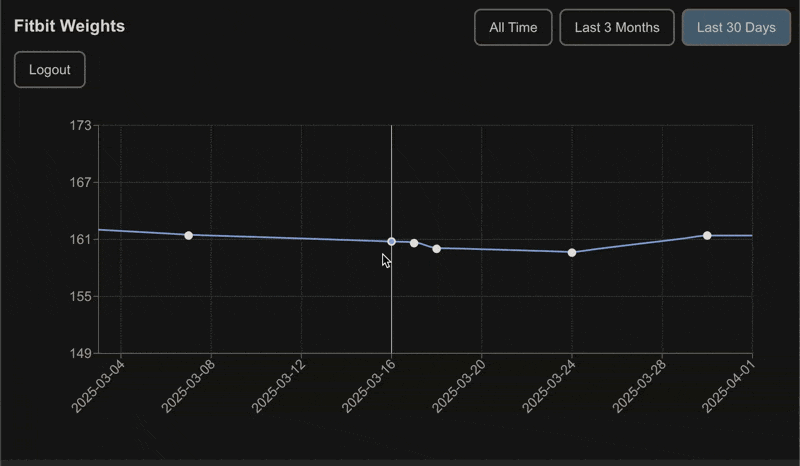

## Fitbit Weight Graph

I was annoyed when Google stopped providing a web dashboard to view your weight data.

I spun up a simple next.js app to view my weigh-ins.

Demo:  

 

## Getting Started
Create your fitbit app at https://dev.fitbit.com/apps/  

Redirect URL format:
`http://localhost:3000/api/auth/callback/fitbit`

## .env file
```bash
FITBIT_CLIENT_ID=XXXXX
FITBIT_CLIENT_SECRET=XXXXX
NEXTAUTH_SECRET=XXXXX
```  


